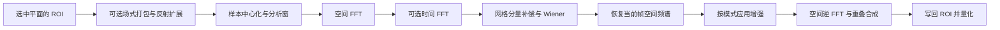

# FFT3D：从像素到频谱，再重建输出

[目录](README.md)

FFT3D 把重叠图像块转换为复数频谱，根据估计噪声抑制频点，再将块合成为画面。`bt=2..5` 还在同一位置的多个帧之间做时间变换；它使用原位置的像素，不会先对齐运动。

[知识库目录](README.md) · [调用与完整参数](../../api/zh-CN/fft3d.md) · [频谱缓存专题](fft3d/spectra-cache.md)

## 1. 先确定要计算哪条路径

普通空间/时间降噪的流程为：



单帧均匀噪声路径会融合 Wiener 和增强，增强使用滤波前的同一残差功率；图中只是功能关系，不能把所有模式都实现成顺序调用同一个增强阶段。

其他模式改变这条路径：有效 `pshow` 直接生成所选块的预览；`bt=-1` 省去降噪；`bt=0` 用有状态 Kalman 递推代替时间 FFT/Wiener。模式选择在创建时由参数决定，首尾帧是否退回空间处理则按请求位置决定。

## 2. 块和工作图像

以下 W、H 是当前平面 ROI 的宽高；Bx、By 是块尺寸。块尺寸使用每平面样本数，YUV420 的色度仍用同样的 Bx、By。

以水平方向为例，重叠 O、步长 S、块数 N 和扩展宽度 P 为：

$$S=B-O,\qquad N=\left\lceil\frac{W-O}{S}\right\rceil+2,\qquad P=NS+O.$$

原 ROI 放在扩展图像的 `[S,S+W)` 内；块 i 从 `iS` 开始。额外两块提供可见边缘所需的完整重叠贡献。垂直方向使用相同公式。

扩展区坐标 x 对应 ROI 坐标 j=x−S，按以下规则读取：

$$r(j)=\begin{cases}-j&j<0\\j&0\le j<W\\2W-2-j&j\ge W.\end{cases}$$

这是不重复端点的一次反射。创建时要求左右 padding 都小于 W，纵向也同样检查，不会无限重复这条反射公式。

例如 ROI 为 64×48，块为 8×6，重叠为 2×2，步长为 6×4，块网格为 13×14，扩展图为 80×58，ROI 起点为 `(6,4)`。处理完成后裁回原 ROI；输出尺寸不变。

`interlaced=True` 会先重排行：高度 8 的 ROI 按 `[0,2,4,6,7,5,3,1]` 排列，再在这张完整工作图像上反射、加窗、滤波，最后逆排列写回。它不拆成两张独立半高图，也不改变时间帧编号。

## 3. 样本、窗口与频谱尺度

### 样本进入什么数值域

整数保持原位深数值。仅整数 YUV 色度减去 `2^(bits−1)`；亮度、RGB 和所有 float 平面都不减中点。例如 10-bit 中性色度 512 变为 0，RGB 中的 512 仍为 512。

公开 sigma 使用 8-bit 标准差单位：

$$\sigma_e=\begin{cases}\sigma\,2^{bits-8}&\text{整数}\\\sigma/255&\text{float32}.\end{cases}$$

所以 sigma=2 对 10-bit 为 8，对 float 约为 0.00784314。输入 float 像素本身不会先乘 255。

### 分析窗和合成窗

无重叠区域的窗为 1。对于重叠肩部 `j=0..O−1`：

$$c_L(j)=\cos\frac{\pi(j-O+1/2)}{2O},\qquad c_R(j)=\cos\frac{\pi(j+1/2)}{2O}.$$

| wintype | 分析窗 a | 合成窗 s |
|---:|---|---|
| 0 | c | c |
| 1 | √c | a³ |
| 2 | 1 | c² |

二维分析按 `(sample−base)·a_y·a_x` 逐次运算。逆变换后乘合成窗；相邻两肩在理想算术下满足 `aL·sL+aR·sR=1`，因此重叠贡献可直接相加，无须每像素除以累计权重。

这不是把三个窗型分别命名为普通 Hann 等窗后任意替换：分析与合成是一对，二者乘积及 binary32 表值都影响重建。O=0 时不计算肩部公式，全部取 1。

### FFT 的方向与归一化

空间正向 FFT 使用负指数且不归一化，实输入只保存 `By×(floor(Bx/2)+1)` 个复数频点。逆变换按 `1/(Bx·By)` 归一化。重建不再额外除以块面积，也不对半谱功率乘 2。

## 4. Wiener 怎样决定保留多少频谱

### 先分离窗形网格分量

令 X 为一个块的空间频谱，G 为“满量程常量块乘分析窗”得到的模板频谱。开启 degrid 时：

$$g=degrid\,\frac{\operatorname{Re}X_{0,0}}{\operatorname{Re}G_{0,0}},\qquad M_k=gG_k,\qquad R_k=X_k-M_k.$$

degrid=0 直接取 R=X、M=0。模板 G 包含窗产生的其他频率，所以此操作不是单独删除 DC。degrid=1 时，理想常量块的频谱全部属于 M，降噪后恢复它即可保留常量亮度。

### 功率、噪声和增益

空间均匀模型的噪声功率为：

$$\nu=B_xB_y\sigma_e^2.$$

它用块面积校准，不是用实际窗能量。每个残差频点采用：

$$P=\operatorname{Re}(R)^2+\operatorname{Im}(R)^2+10^{-15},$$
$$w=\max\left(\frac{P-\nu}{P},\frac{\beta-1}{\beta}\right),\qquad Y=wR+M.$$

beta=1 时，功率不超过噪声的残差被压到 0；beta=2 时至少保留残差幅度的一半。这里过滤的是功率与噪声功率的关系，不是直接比较复数幅度和 sigma。

### 频率曲线与实测噪声

模型选择顺序是正 pfactor 的实测表、四个 sigma 不同的解析曲线、最后才是均匀噪声。曲线将 sigma1..4 插值后平方并按空间 FFT 尺度校准；实测表则直接来自选中块的残差功率：

$$P_k^{sample}=pfactor\,|X_k-gG_k|^2\,
\frac{f_x^2+f_y^2}{f_x^2+f_y^2+pcutoff^2},$$

其中 `fx=2x/Bx`，`fy=2min(y,By−y)/By`。这些坐标用于实测模型；解析 sigma 曲线使用不同的频率坐标与插值节点，不能直接套用，精确定义见[噪声与增强](fft3d/noise-enhancement.md)。

自动选块只搜索 `bx=2..Nx−3、by=2..Ny−3`，即排除块网格四周各两层，因此网格至少要有 5×5 个块。它最小化未乘 pfactor 的加权功率总和，按块行、块列顺序取第一个最小值；手动坐标直接选块。实测表已经是功率，不能再平方一次或再乘块面积。

## 5. 多帧处理为何仍只输出当前帧

令 T 为该请求实际使用的帧数。配置 bt 对应的邻域如下；缺任何一帧就退回 T=1。

| bt | 从早到晚的源帧偏移 | 当前帧在时间数组中的下标 c |
|---:|---|---:|
| 2 | −1、0 | 1 |
| 3 | −1、0、+1 | 1 |
| 4 | −2、−1、0、+1 | 2 |
| 5 | −2、−1、0、+1、+2 | 2 |

同一个空间频点的 T 个值先做时间 DFT：

$$F_{m,k}=\sum_{j=0}^{T-1}X_{j,k}\exp(-2\pi i jm/T).$$

这里不再加时间分析窗。均匀噪声功率成为 `T·Bx·By·sigma_e²`；曲线或实测表则乘 T。degrid 使用**当前块**的 DC 比例，只从时间频率 m=0 中移除 `T·M`，其他时间频率不作这项扣除。

逐时间频点执行 Wiener 后恢复该网格分量，再只还原当前下标 c：

$$Y_k=\frac1T\sum_{m=0}^{T-1}F^{out}_{m,k}\exp(+2\pi i cm/T).$$

之后继续空间逆变换和合成。因此 T=2 的时间频点不能直接相加后当成当前帧；按上述时间顺序，应取 `(Fout0−Fout1)/2`。

相邻输出会重复需要同一些 X，但它们的中心 DC、时间邻域和滤波结果不同。[频谱缓存](fft3d/spectra-cache.md)复用原始 X，不复用被滤波后的 Y。

## 6. Kalman 和增强在什么位置

Kalman 不执行上述时间 DFT。对每个空间频点保存上次估计 L、协方差 C 和过程协方差 Q。虚拟初始状态为 `L=0，C=Q=R0`，R0 由 sigma 和块面积得到；源帧 0 不用于初始化，输出帧 0 原样复制。

从源帧 1 开始，如果 X 与 L 的实部或虚部的平方差超过 `R·kratio²`，同时重置两部分为当前 X，C、Q 取 R。否则用旧 C、Q 计算：

$$s=C+Q,\qquad k=\frac{s}{s+R},$$
$$L'=kX+(1-k)L,\qquad C'=(1-k)s,\qquad Q'=k^2R.$$

均匀噪声 R=0 有专门的恒等分支，避免 0/0。曲线或采样模型使用带正下限的逐频点 R；Kalman 的正 pfactor 只选择实测模型，不缩放其功率。

随机请求 n 只从补算量不超过 kalman_warmup+1 的最近已完成检查点恢复；没有合格检查点则从 max(1,n-kalman_warmup) 初始化预热。默认 8 个历史帧加目标帧，连续处理则延续长期状态。请求历史、缓存和并发可能改变结果。当前 C/Q 的实、虚逻辑分量始终分别相等，因此物理上只需一个 C 和一个 Q，加上复数 L，共 16 字节/频点；C 和 Q 不能彼此合并。

锐化和去光晕基于空间残差功率 q 及频率权重。锐化提高所选频带，去光晕衰减相应频带。它们与降噪的组合顺序为：

| 路径 | 增强使用的频谱 |
|---|---|
| T=1、均匀噪声 | 与 Wiener 共用原始残差功率，融合增益 |
| T=1、曲线或实测噪声 | 先 Wiener，再对结果重新计算增强残差和功率 |
| T>1 | 时间 Wiener 并恢复当前空间频谱后增强 |
| bt=−1 | 原始空间频谱直接增强 |
| Kalman | L 的私有副本增强；增强结果不写回递推状态 |

两种增强强度都为零时跳过增强算术；有效 pshow 则覆盖整个降噪/增强流程。

## 7. 一个完整的 4×4 例子

取一张 16×16 GRAY8 图像，每一行都重复 `[10,14]`。参数为 `bw=bh=4、ow=oh=0、bt=1、sigma=4、beta=1、degrid=0`，增强关闭。这个图像大小满足扩展几何；没有重叠，窗口全为 1。

每个块四行相同：

```text
10 14 10 14
10 14 10 14
10 14 10 14
10 14 10 14
```

未归一化的二维 FFT 只有两个非零频点：DC 为 192，水平 Nyquist 为 −32；其他频点为 0。噪声功率为 `16×4²=256`。忽略远小于当前数值精度的 epsilon，beta=1 时：

| 频点 | 输入 | 功率 | 增益 | 输出 |
|---|---:|---:|---:|---:|
| DC | 192 | 36864 | 143/144 | 190⅔ |
| 水平 Nyquist | −32 | 1024 | 3/4 | −24 |

逆变换除以块面积 16：

$$u_{even}=\frac{190\tfrac23-24}{16}=10.416\overline6,\qquad
u_{odd}=\frac{190\tfrac23+24}{16}=13.416\overline6.$$

无重叠，所以每像素只有一个块贡献；整数输出加 0.5 后截断并裁剪，得到每行重复 **`[10,13]`**。原来的两档差值 4 缩小为 3，均值也略有下降，因为本例刻意关闭 degrid，让 DC 也参与 Wiener。

若用默认 degrid=1，常量分量先被移除再恢复，不能套用本例“直接衰减 DC”的计算。

## 8. 重建、边界与结果确定性

空间逆变换已经归一化。块先乘水平合成窗，按块从左到右累计；再乘垂直合成窗，按块行从上到下累计。该顺序也是并发执行必须保留的结果顺序，不能靠浮点原子加法任意合并。

最终整数转换依次形成 `(reconstructed+0.5)+base`，裁到位深范围再安全地向零截断；float 输出直接裁到 `[0,1]`。**float 色度也如此**。未处理平面、ROI 外部及 Kalman 帧 0 的复制不走这套量化。AVS 显式模式 1 完全跳过输出写入，帧 0 也如此。

FFT3D 不自行创建工作线程，各平面在宿主调用线程内依次计算，Kalman 的逐帧回放也如此。宿主仍可同时请求多个输出帧，每个请求保有自己的工作区和可变递推状态。

相同算术配置下，非 Kalman 模式的缓存开关、访问顺序和宿主线程调度不应改变输出；有界预热的 Kalman 不保证这一点。改变 scalar/Highway 或 FFT 算术路径则可能改变舍入，尤其在频率阈值、Kalman 重置阈值和最终半 LSB 附近；不能据一次样例逐位一致推断所有输入都精确相同。

原始参数即使未被当前模式消费，也须通过定义域检查。实际处理的输入与中间值要求有限；内存分配、几何或数值错误会导致创建/取帧失败，不会将非法模式偷偷替换成其他算法。

与旧 Neo 系的行为差异见[迁移说明](../../api/zh-CN/migration.md)。

专题：[噪声与增强](fft3d/noise-enhancement.md) · [Kalman 状态与回放](fft3d/kalman.md) · [样本尺度](shared/sample-domain.md) · [窗口与重建](shared/windows-reconstruction.md)。
